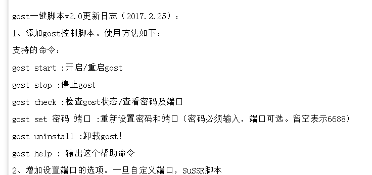

# GOST搭建脚本2.0(backups)

支持 CentOS 6+/Debian 7+/Ubuntu 12+

## 安装 ##
    wget -N --no-check-certificate https://raw.githubusercontent.com/Admin-backups/GOST-B/master/install.sh && bash install.sh
## 说明 ##

